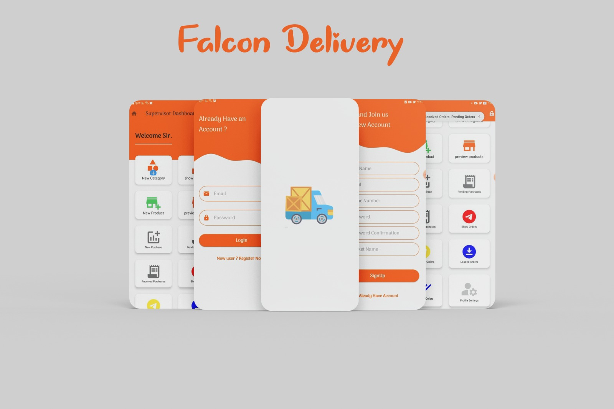
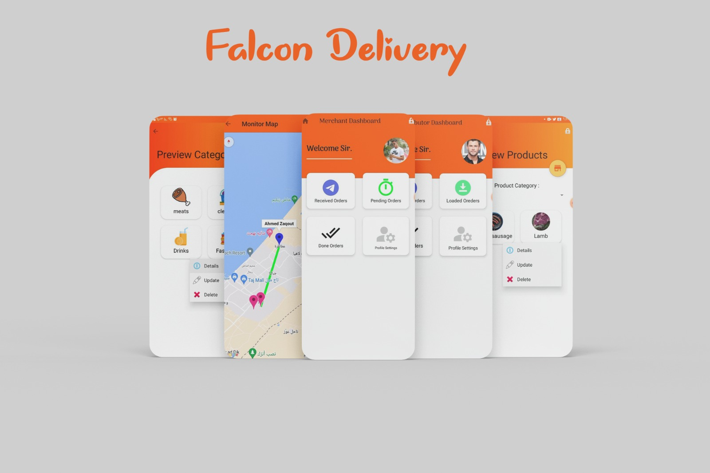
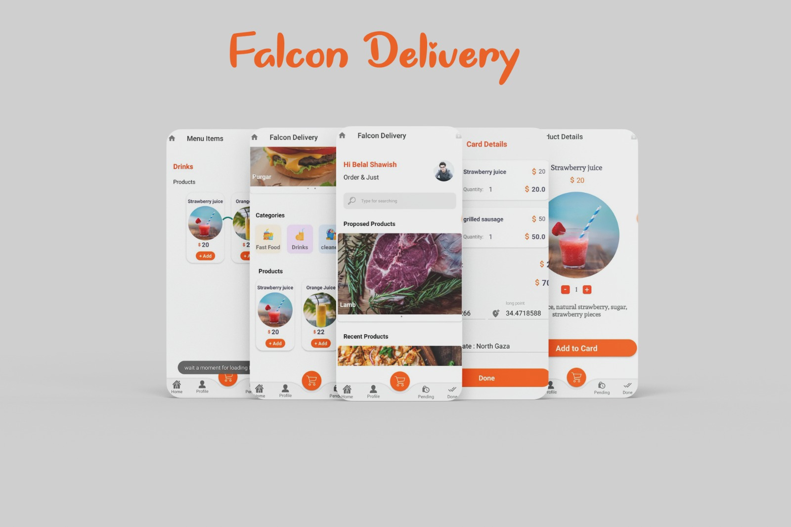

# 🛵 Falcon Delivery App
[](LICENSE)
A smart delivery solution crafted for seamless order handling, real-time tracking, and efficient communication between users and delivery personnel.

---

## 📱 Overview

**Falcon Delivery App** is an Android application designed to simplify food and item delivery, connecting users with delivery agents efficiently. Built with **Java** and **Android Studio**, this graduation project addresses delivery challenges in areas with logistical difficulties.
Users can place orders, while delivery agents manage and track them in real time. The app uses a Firebase-powered backend for seamless communication and map-based navigation.

---

## ✨ Features

- 🔐 **User Authentication**: Secure login and registration for both users and delivery agents.
- 🗺️ **Map Integration**: Users can set delivery locations on the map; delivery agents can view them in real time.
- 🚚 **Order Management**: Users can place orders, and delivery agents can accept and track them.
- 🔄 **Real-Time Updates**: Firebase integration keeps users and agents in sync.
- 📦 **Order Status Tracking**: Users can follow the progress of their deliveries.
- 📁 **Clean Code Architecture**: Organized packages, reusable components, and clear naming.
- 📸 **Modern UI/UX**: Simple and intuitive design focused on user experience.

---

## 🔧 Technologies Used
- 💻 **Android Studio** (Java)
- ☁️ **Firebase Realtime Database**
- 🗺️ **Google Maps SDK**
- 🔐 **Firebase Authentication**
- 🧭 **Live Location Services**
- 🎨 **Material Design UI Components**

---

## 🛠️ Installation

1. Clone the repository:
   ```bash
   git clone https://github.com/FaresSaleemGHub/Falcon-Delivery-App.git
2. Open with Android Studio.
3. Connect to Firebase (or use your own config).
4. Build & Run on an Android device or emulator.

---

## 📱 App Demo
Here’s a quick preview of the app in action:
### 🖼️ Image Preview




### 🎥 Video Demo
[▶️ Click to watch demo](https://www.youtube.com/playlist?list=PLWqURIX0Cj4I8uG2kj1EyXeI3zCTjEZdh)

---

## 🧑‍🎓 About the Project
This application was developed as a graduation project to address local delivery problems and provide technical solutions using Android development practices. It showcases backend integration, real-time location tracking, and user-friendly design.

---

## 👤 Author
Written with passion by – @FaresSaleemGHub

---

## 📜 License
This project is open-source and available under the MIT License.

